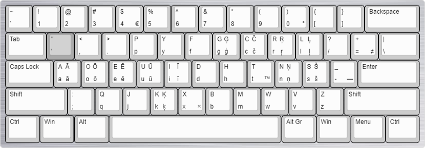

# Klaviatūru izkārtojumi

Daži Windows klaviatūru izkārtojumi, veidoti ar [Microsoft Keyboard Layout Creator](https://www.microsoft.com/en-us/download/details.aspx?id=102134).

Uzstādīšana: lejupielādēt zip arhīvu, atpakot, un palaist `setup.exe`.

## Latviešu QWERTY (`lv-LV_qwerty`)
Būtībā tas pats, kas Windows 8 un vēlākos iekļautais "Latvian (Standard)" (un [laacz “Apostrofs”](https://laacz.lv/apostrofs)), bet ar pāris niansēm:
* `Shift + '` nav mēmais taustiņš (t.i., uzreiz raksīs `"`)
* Decimālais atdalītājs ir punkts.
* Pieturot `Alt Gr`, var dabūt dažus īpašos simbolus: `°`, `—`, `≠`, `€`, `™` un `×`.

## Latviešu + UK QWERTY (`lv-UK_qwerty`)
Kopā ar Anci radīts izkārtojums, kas apvieno latviešu un Lielbritānijas klaviatūru izkārtojumus:
* UK klaviatūras izkārtojums un specsimboli (`£`, `á`, u.c.)

## Latviešu Dvorak (`lv-LV_dvorak`)
Ja tu nezini, kas tas ir, tu to visticamāk negribi. [Bet varbūt tu gribi uzzināt](https://en.wikipedia.org/wiki/Dvorak_keyboard_layout).
Tās pašas nianses, kas latviešu QWERTY, tikai citās vietās.

