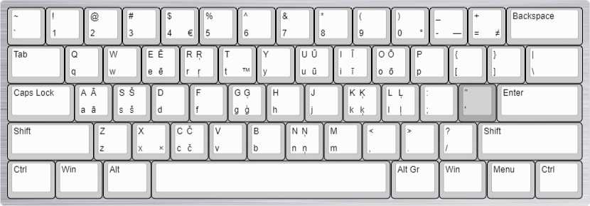

# Klaviatūru izkārtojumi

Daži Windows klaviatūru izkārtojumi. Veidoti ar [Microsoft Keyboard Layout Creator](https://www.microsoft.com/en-us/download/details.aspx?id=102134).

## Latviešu QWERTY
Būtībā tas pats, kas Windows 8 un vēlākos iekļautais "Latvian (Standard)" (un [laacz “Apostrofs”](https://laacz.lv/apostrofs)), bet ar pāris niansēm:
* `Shift + '` nav mēmais taustiņš (t.i., uzreiz raksīs `"`)
* Decimālais atdalītājs ir punkts.
* Pieturot `Alt Gr`, var dabūt dažus īpašos simbolus: `°`, `—`, `≠`, `€`, `™` un `×` (attēlā attiecīgā taustiņu vidū).

